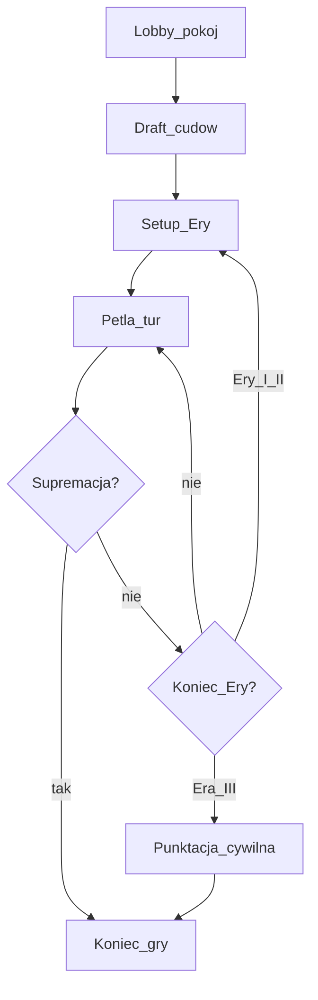
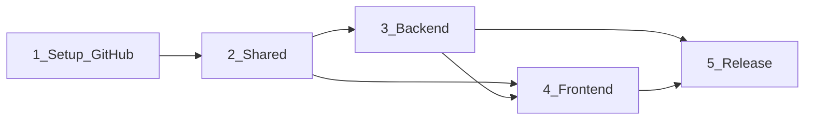

# Plan realizacji 7WW

Internetowa wersja gry planszowej **7 Cudów Świata — pojedynek** (2 graczy), monorepo TypeScript.

## Założenia (zamknięte)

- Zakres reguł: **tylko gra podstawowa** (bez Pantheon / Agora) — decyzja **1A**.
- Multiplayer MVP: **pokój z kodem + WebSocket**, gracze jako **goście** (bez kont) — decyzja **2A**.
- Stack: monorepo TypeScript — `shared/`, `backend/`, `frontend/` (React/TSX), zgodnie z regułami w `.cursor/rules/`.
- Repo: `https://github.com/Tomusdolny/7WW.git` (gałąź `main`).
- UI/wygląd: poza zakresem tego planu (określi zespół projektowy później).
- Autorytatywna logika reguł: **backend**; klient tylko prezentuje stan i wysyła intencje ruchów.

## Szkielet domeny gry (do modelowania w shared/backend)

Kluczowe bloki reguł do pokrycia w silniku (bez UI): przygotowanie, draft cudów, piramida kart (dostępność face-up/face-down), 3 akcje tury (budowa / discard na monety / budowa cudu), produkcja i handel, łańcuchy, tor militarny + żetony, symbole nauki + żetony postępu, efekty cudów (w tym dodatkowa tura), limit 7 cudów w partii, 3 warunki zwycięstwa.

---

## Faza 1 — Setup GitHub

1. Uporządkować repo: struktura monorepo (`shared`, `backend`, `frontend`), root `package.json` (workspaces) lub równoważny tooling, `.gitignore`, `.editorconfig`, `LICENSE`/`README` (krótki opis + jak uruchomić — bez designu gry).
2. Branching: `main` chroniony; workflow `feature/*` → PR; wymagane status checks (lint/test/build) gdy CI będzie gotowe.
3. Issues / Projects: etykiety wg faz (`phase:setup`, `phase:shared`, `phase:backend`, `phase:frontend`, `phase:release`) + epiki odpowiadające fazom.
4. CI (GitHub Actions): install → lint → test → build dla pakietów; cache zależności.
5. Secrets/env: szablony `.env.example` (porty, CORS, URL WebSocket) — bez sekretów w repo.
6. **Definition of Done:** zielone CI na pustym szkielecie monorepo; PR template; README z komendami `dev`/`build`/`test`.

---

## Faza 2 — Shared

Pakiet wspólny konsumowany przez backend i frontend (typy + czyste funkcje bez I/O).

1. **Model danych kart i komponentów gry** — identyfikatory i schematy: karty Er I–III, gildie, cuda, żetony postępu/militarnych, zasoby, symbole nauki, koszty, łańcuchy, efektyty (jako dane, nie UI).
2. **Stan partii (GameState)** — gracze, skarbiec, miasto, cuda (posiadane/zbudowane), piramida Ery, talia/odrzucone, tor konfliktu, żetony na planszy, faza gry, aktywny gracz, historia ruchów (minimalna pod replay/debug).
3. **Komendy / eventy** — kontrakt: `CreateRoom`, `JoinRoom`, `SelectWonder`, `PlayCard` (build/discard/wonder), `ChooseProgressToken`, ewentualne wybory wynikające z efektów; odpowiedzi: `RoomState`, `GameStateView` (perspektywa gracza: ukryte karty face-down przeciwnika/piramidy), `Error`.
4. **Walidacja i silnik reguł (pure)** — funkcje: legalne ruchy, koszt budowy/handlu, aplikacja efektów, przejścia faz, warunki końca; testy jednostkowe jako źródło prawdy o regułach.
5. **Widoki / masking** — funkcja `toPlayerView(state, playerId)` — co wolno ujawnić klientowi.
6. **Wersjonowanie protokołu** — pole `protocolVersion` w wiadomościach WS, żeby release mógł ewoluować bez łamania sesji.
7. **Definition of Done:** pakiet `shared` buduje się; pokrycie testami ścieżek happy-path + krytycznych edge case’ów (handel, łańcuchy, supremacje, setup Ery III z gildiami, 7. cud).

### Kolejność wdrożenia silnika w shared (inkrementy)

1. Setup + draft cudów
2. Piramida + wybór karty dostępnej
3. Build / discard / handel / łańcuchy
4. Militarny tor + żetony
5. Nauka + żetony postępu + supremacja naukowa
6. Efekty cudów + dodatkowa tura + limit 7 cudów
7. Koniec Ery / kto zaczyna kolejną / punktacja cywilna

---

## Faza 3 — Backend

Warstwy: transport (HTTP/WS) → aplikacja (pokoje/sesje) → domena (`shared` engine) → persystencja (na start in-memory, później opcjonalnie store).

1. **Szkielet serwera** — Node + TypeScript; HTTP healthcheck; WebSocket; CORS; konfiguracja z env.
2. **Lobby / pokoje** — tworzenie pokoju (kod), dołączanie drugiego gracza, statusy `waiting` / `in_game` / `finished`, odrzucenie 3+ gracza, reconnect po zerwaniu WS (ten sam `playerToken` z cookies/localStorage emitowany przy join).
3. **Orkiestracja partii** — po 2 graczach: init stanu przez `shared`, broadcast widoków per gracz; przy komendzie: walidacja → apply → emit; odrzucanie nielegalnych ruchów z kodem błędu.
4. **Synchronizacja i spójność** — jeden writer na pokój (kolejka komend); idempotencja / numer sekwencji stanu (`stateVersion`) po stronie klienta.
5. **Timeouty / obecność** — heartbeat WS; polityka na disconnect (MVP: oczekiwanie z limitem czasu, potem auto-resign).
6. **Obserwowalność** — logi z `roomId` / `stateVersion` bez PII; metryki podstawowe (aktywne pokoje).
7. **Testy** — integracyjne: 2 klienty WS przechodzą draft → kilka tur → koniec; testy regresji reguł przez `shared`.
8. **Definition of Done:** da się rozegrać pełną partię „headless” (skrypt/test) przez WS zgodnie z regułami podstawowymi.

---

## Faza 4 — Frontend

Bez szczegółów wizualnych — tylko warstwy funkcjonalne pod przyszły design.

1. **Szkielet aplikacji** — React/TSX, routing: landing → create/join → ekran gry → wynik.
2. **Warstwa sieciowa** — klient WS, kolejka wiadomości, reconnection, mapowanie `GameStateView` → store UI.
3. **Ekrany funkcjonalne (wireframe logiczny, nie wygląd)** — lobby (kod pokoju, status przeciwnika); draft cudów; plansza Ery (piramida, dostępność kart); miasto/skarbiec/tor/żetony; wybór akcji na karcie; wybór żetonu postępu; ekran końca (powód zwycięstwa + punktacja).
4. **Feedback reguł** — podświetlenie legalnych ruchów / komunikaty błędów z backendu; stany loading/disconnected.
5. **Dostępność interakcji** — fokus klawiatury na akcjach tury (wymóg z reguł frontend).
6. **Testy** — testy jednostkowe store/adapterów; smoke e2e join + jeden ruch (gdy CI pozwoli).
7. **Definition of Done:** dwóch graczy w dwóch przeglądarkach rozgrywa pełną partię podstawową end-to-end.

Kolejność frontu śledzi gotowość backendu: lobby → draft → tura podstawowa → militarny/nauka → cuda/efekty → punktacja.

---

## Faza 5 — Release

1. **Build produkcyjny** — artifacty frontend (static) + backend; wspólna wersja / git sha w healthcheck.
2. **Kontenery** — `Dockerfile` (+ opcjonalnie `compose`) dla lokalnego prod-like i prostego hostingu.
3. **Konfiguracja środowiska** — `PUBLIC_WS_URL`, CORS origin, limity pokoi; checklist sekretów.
4. **Jakość przed release** — checklist regresji reguł (supremacje, handel, Ery, gildie, 7. cud); load smoke (N pustych pokoi).
5. **Wersjonowanie** — tagi semver / GitHub Releases; changelog z breaking changes protokołu.
6. **Operacje** — strategia deploy (np. jedna maszyna / PaaS); rollback; monitoring uptime healthcheck.
7. **Prawne / produktowe (lekko)** — w README: inspiracja regułami gry planszowej; brak assetów oficjalnych bez licencji; dane kart jako własne identyfikatory/teksty robocze do czasu decyzji zespołu.
8. **Definition of Done:** publiczny URL (lub wewnętrzny staging) z działającą partią 2 gości; tag release; runbook krótkiego deployu.

---

## Kolejność prac między fazami

Frontend może startować równolegle po stabilnym kontrakcie WS w `shared`, ale pełne E2E wymaga backendu.

## Kryteria akceptacji całego MVP

- Dwóch gości: create/join po kodzie, reconnect.
- Pełna partia reguł podstawowych z trzema ścieżkami zwycięstwa.
- Nielegalne ruchy odrzucane; stan spójny u obu graczy.
- CI zielone; jeden udany release na staging/prod.
